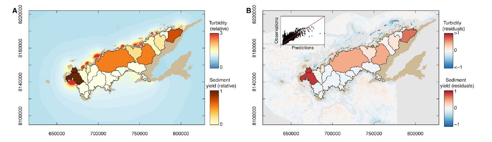

#  Code for Tracing the influence of land-use change on water quality and coral reefs using a Bayesian model

2020-09-25

This repository has code for fitting a Bayesian model that links coastal water quality as measured by satellites to catchment runoff.

Citation:

[Brown CJ, Jupiter SD, Albert S, Klein CJ, Mangubhai S, Maina JM, Mumby P, Olley J, Stewart-Koster B, Tulloch V, Wenger A. Tracing the influence of land-use change on water quality and coral reefs using a Bayesian model. Scientific reports. 2017 Jul 6;7(1):1-0.](https://www.nature.com/articles/s41598-017-05031-7)

**Figure** Results from the model's application to Vanua Levu, Fiji, showing predicted catchment contributions to coastal WQ, interpolated coastal WQ and residuals from the fits.

### Abstract (from the paper)

"Coastal ecosystems can be degraded by poor water quality. Tracing the causes of poor water quality back to land-use change is necessary to target catchment management for coastal zone management. However, existing models for tracing the sources of pollution require extensive data-sets which are not available for many of the world’s coral reef regions that may have severe water quality issues. Here we develop a hierarchical Bayesian model that uses freely available satellite data to infer the connection between land-uses in catchments and water clarity in coastal oceans. We apply the model to estimate the influence of land-use change on water clarity in Fiji. We tested the model’s predictions against underwater surveys, finding that predictions of poor water quality are consistent with observations of high siltation and low coverage of sediment-sensitive coral genera. The model thus provides a means to link land-use change to declines in coastal water quality."

### Using this code

Feel free to email me if you have queries about running these models (chris.brown@griffith.edu.au). The model was created in 2015, so R has progressed considerably since then. If I was to do this again, I'd use updated spatial packages (updates to raster and pkg sf, instead of sp), and probably write the model with STAN which is much faster at fitting models than JAGS.

## Brief description of files and folders

/wq_bayes_testsim has scripts for running the simulation tests described in the paper

The core of the Bayesian model (the JAGS code) is in BayesianTracingModel.txt

B3_Turbidity_model_power_hierarchical_2alpha.R is the script I used to run the main model for Fiji presented in the paper (includes model pre and post processing). The three datafiles for this script are also here, as .csv files.

B4_model_predictions_power_hierarchical_2alpha.R demonstrates some of the post-processing and how to do model predictions (again this could be updated )

B3_GAM_turbidity_model.R demonstrates a much simpler way of fitting turbidity models, using GAMs. This is useful for interpolating turbidity (and gives very similar turbidity maps to what the Bayesian model has), but GAMs can't determine the contribution of individual rivers.

There are other steps before script B3 that relate to downloading the MERIS turbidity images and processing those to average over time and also to resample them to a lower resolution (JAGS slows down drastically the larger your dataset).
I haven't shared that code here, as it will be specific to each project, I haven't documented it very well and the R spatial methods used are not up to date with the latest spatial packages.
